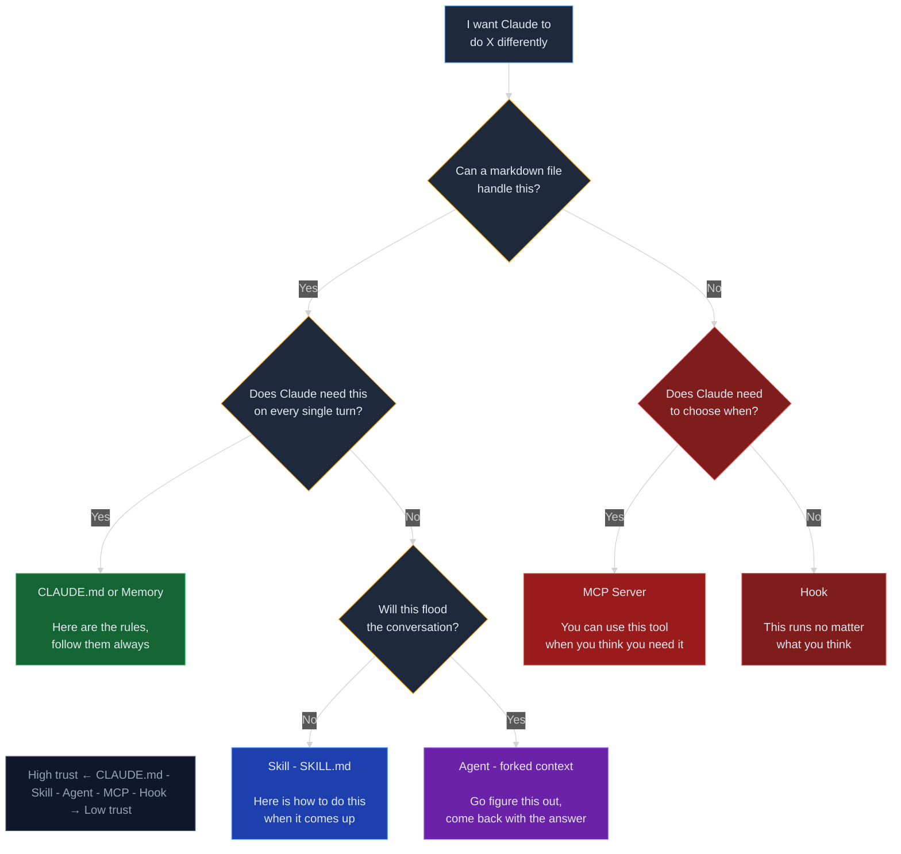

# Claude Tool Decision Guide

## Visual Decision Tree

When you want Claude to behave differently, use this flowchart to choose the right tool:

---

## The 5 Options (High Trust → Low Trust)

### 1. CLAUDE.md or Memory
**Trust Level: 🟢🟢🟢 HIGHEST**

- **When to use:** Rules that apply to every Claude Code session in this repo
- **Example:** AEO formatting rules (always apply, never optional)
- **Who decides:** You decide upfront; Claude follows automatically
- **Change control:** Edit the file, change applies to all future sessions

### 2. Skill (SKILL.md)
**Trust Level: 🟢🟢 HIGH**

- **When to use:** How-tos for specific workflows; Claude invokes when relevant
- **Example:** "Run the gap audit before submitting" — user types `/gap-audit`
- **Who decides:** User explicitly invokes (`/skill-name`)
- **Change control:** Skills are version-controlled; changes apply on invocation

### 3. Agent
**Trust Level: 🟡 MEDIUM**

- **When to use:** Complex, multi-step tasks; Claude spawns a separate session to think independently
- **Example:** "Analyze this codebase and find architecture patterns"
- **Who decides:** Claude decides whether to spawn an agent (based on guidance in CLAUDE.md)
- **Change control:** Agents run with fresh context; no session state carries over

### 4. MCP Server
**Trust Level: 🟠🟠 LOW-MEDIUM**

- **When to use:** Tool access that Claude can optionally use when it thinks it needs it
- **Example:** "You have access to the PostgreSQL MCP server to query the database"
- **Who decides:** Claude decides when to call the tool
- **Change control:** Tools are always available; Claude chooses invocation

### 5. Hook (Pre/Post Tool Use)
**Trust Level: 🔴 LOWEST**

- **When to use:** Automated guardrails that run whether Claude likes it or not
- **Example:** "Block `rm -rf` commands" — runs before any bash command executes
- **Who decides:** Hook runs automatically, no discretion
- **Change control:** Hooks are enforced globally; always active

---

## Quick Reference

| Option | Applies To | Who Decides | Update Frequency | Example |
|--------|-----------|------------|------------------|---------|
| **CLAUDE.md** | Every session, always | You (upfront) | File edit | "Always use tables for structured data" |
| **Skill** | When user invokes | User (explicit) | Version-controlled | `/gap-audit` command |
| **Agent** | On complex tasks | Claude (guided) | Per-invocation | "Spawn explorer agent for codebase analysis" |
| **MCP Server** | Optional tool use | Claude (when needed) | Available always | Database query access |
| **Hook** | Every action (auto) | Automatic | Always active | "Block destructive bash commands" |

---

## Writing Guidelines by Tool Type

### ✍️ CLAUDE.md
- **Audience:** Claude reading it every session
- **Format:** Markdown sections with clear headings
- **Length:** Concise; keep it scannable
- **Tone:** Imperative ("Always...", "Never...", "Do this...")
- **Update:** When rules change fundamentally

### ✍️ Skill.md
- **Audience:** Claude deciding when to invoke (via `/command`)
- **Format:** Markdown with command name, description, steps
- **Length:** Fit in ~200-500 words; link to longer docs if needed
- **Tone:** Procedural (step-by-step, "then do X")
- **Update:** When the workflow changes

### ✍️ Agent Prompts
- **Audience:** Fresh Claude session with no prior context
- **Format:** Complete briefs; assume zero context carry-over
- **Length:** 300-500 words of clear instructions
- **Tone:** Narrative ("You're being asked to...", "The context is...")
- **Update:** Per-task; can change without affecting repo

### ✍️ MCP Servers
- **Audience:** Claude's tool selection logic
- **Format:** Function signatures + docstrings
- **Length:** Concise; let the tool design speak
- **Tone:** Technical (parameter names, return types)
- **Update:** When API surface changes

### ✍️ Hooks
- **Audience:** Bash/tool use logic (pre/post)
- **Format:** Shell scripts with clear comments
- **Length:** Minimal; run fast
- **Tone:** Technical (grep patterns, exit codes)
- **Update:** When security/safety boundaries change

---

## AEO Rules Apply To Documents, Not Tools

**Important:** The **AEO Formatting Rules** (40-60 word summaries, H2/H3 hierarchy, multi-domain examples) apply to **documents you write in this repo** (Knowledge Base, Execution, Learning, Foundations guides). 

AEO rules do **NOT** apply to:
- CLAUDE.md itself (tools have different standards)
- Skills/Agents/Hooks (procedural, not educational)
- MCP server code (technical specification, not prose)

**Applies to:** Core educational documents, tutorials, guides, reference materials.
