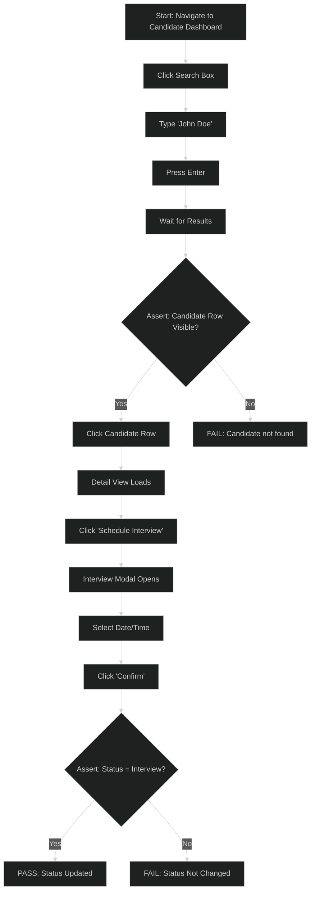

# Tester Procedures: QA Automation Workflows

## Chrome MCP Test Automation

**Goal:** Run automated test suites via the Claude-in-Chrome MCP to validate UI behavior, business logic, and acceptance criteria.

### Workflow

1. **Launch Chrome and navigate to test target**
   - Use `mcp__claude-in-chrome__tabs_context_mcp` to initialize the tab group
   - Use `mcp__claude-in-chrome__navigate` to go to the page under test
   - Verify page load and initial state via `mcp__claude-in-chrome__screenshot`

2. **Instrument the page with test listeners (optional)**
   - Use `mcp__claude-in-chrome__javascript_tool` to inject assertion helpers if needed
   - Example: inject a global test reporter that logs pass/fail to console
   - This enables observable assertions in the browser console

3. **Execute test steps via Chrome automation**
   - Use `mcp__claude-in-chrome__left_click` to trigger user actions
   - Use `mcp__claude-in-chrome__form_input` to fill forms
   - Use `mcp__claude-in-chrome__type` to enter text
   - Use `mcp__claude-in-chrome__key` to submit forms or navigate via keyboard
   - Use `mcp__claude-in-chrome__scroll` to reveal content if needed

4. **Capture observable assertions**
   - After each action, read page state: `mcp__claude-in-chrome__read_page` or `mcp__claude-in-chrome__screenshot`
   - Use `mcp__claude-in-chrome__javascript_tool` to execute assertions and log results to console
   - Example: `document.querySelector('[data-test=status]').textContent` to check updated UI state
   - Print pass/fail to console: `console.log('PASS: Status changed to interview')`

5. **Record GIF evidence (see GIF Recording section)**
   - Record before test actions, stop after final assertion
   - Ensures GIF shows the complete test sequence

### Example: Test Candidate Pipeline Progression

```
Test: Verify candidate status progression cold → interview

1. Navigate to candidate dashboard
2. START GIF RECORDING (before first click)
3. Search for "John Doe" candidate
   - Click search box
   - Type name
   - Press Enter
4. Verify candidate appears in search results
   - Assert: Row shows "John Doe" with status "cold"
   - PASS: Candidate found with status=cold
5. Click on candidate row to open detail view
6. Click "Schedule Interview" button
7. Select interview date/time
8. Click "Confirm" button
9. Verify status updated in detail view
   - Assert: Status field now shows "interview"
   - PASS: Status changed to interview
10. Navigate back to dashboard
11. Verify dashboard search shows updated status
    - Assert: Candidate row shows status "interview"
    - PASS: Dashboard refreshed, status persisted
12. STOP GIF RECORDING (after final assertion shown)
13. Save GIF as: tests/test-candidate-status-pipeline.gif
```

## GIF Recording: Workflow and Configuration

**Why record GIFs:** GIFs document the exact sequence of user actions and observable results. They serve as irrefutable evidence that the test ran and succeeded. No interpretation required—the visual sequence tells the whole story.

### Recording Lifecycle

#### Before Test Actions

```
gif_creator(action='start_recording', tabId=<current_tab>)
# Returns: recording active
```

Start recording BEFORE clicking anything. This captures the initial state as the first frame.

#### Execute All Test Steps

Run the complete test workflow (navigate, click, fill, assert). All actions are automatically captured.

#### After Final Assertion Visible

Stop recording AFTER the success state is visible on screen:

```
gif_creator(action='stop_recording', tabId=<current_tab>)
# Returns: recording stopped, ready for export
```

#### Export with Configuration

```
gif_creator(
  action='export',
  tabId=<current_tab>,
  download=True,
  filename='test-candidate-status-pipeline.gif',
  options={
    'showClickIndicators': True,    # Orange circles at clicks
    'showActionLabels': True,        # Black labels ("Click", "Type")
    'showDragPaths': True,           # Red arrows for drags
    'showProgressBar': True,         # Orange progress bar
    'showWatermark': False,          # Disable Claude watermark for clarity
    'quality': 10                    # Compression quality (1=best, 30=worst)
  }
)
```

### GIF Configuration: Visibility Standards

| Option | Setting | Reason |
|--------|---------|--------|
| `showClickIndicators` | True | Orange circles show exactly where user clicked |
| `showActionLabels` | True | Black labels describe what happened ("Click", "Type search text") |
| `showDragPaths` | True | Red arrows show drag sequences if applicable |
| `showProgressBar` | True | Orange bar at bottom shows test progress |
| `showWatermark` | False | Claude watermark distracts from test evidence |
| `quality` | 10 | High quality preserves assertion visibility |

All four visual indicators must be enabled. This ensures the GIF is glance-verifiable: a reviewer sees actions and results instantly.

### Filename Convention

Filenames describe the test in 3–5 words, hyphen-separated:

| Test | Filename |
|------|----------|
| Create new candidate profile | `test-create-candidate-profile.gif` |
| Candidate pipeline progression | `test-candidate-status-pipeline.gif` |
| Place order and verify fill | `test-place-order-and-fill.gif` |
| Deploy and verify health | `test-deploy-and-verify-health.gif` |
| Page load performance | `test-page-load-performance.gif` |

Filenames should be noun-based (the thing being tested), not verb-based. ✅ `test-candidate-profile-creation` vs ❌ `test-creating-candidate`

### Example: Complete Recording Session

```
# Initialize tab and navigate
tabs_context_mcp(createIfEmpty=True)
# Tab ID returned: 123

# Start recording BEFORE any action
gif_creator(action='start_recording', tabId=123)

# Execute test steps
navigate(url='https://recruiting.app/candidates', tabId=123)
screenshot(tabId=123)  # Verify page loaded

left_click(ref=<search_box_ref>, tabId=123)
type(text='John Doe', tabId=123)
key(text='Enter', tabId=123)

# Verify result and let assertion display
screenshot(tabId=123)
javascript_tool(action='javascript_exec', text='console.log("PASS: Candidate found")', tabId=123)
screenshot(tabId=123)  # Capture assertion output

# Stop recording after assertion is visible
gif_creator(action='stop_recording', tabId=123)

# Export with full visibility
gif_creator(
  action='export',
  tabId=123,
  download=True,
  filename='test-search-candidate.gif',
  options={'showClickIndicators': True, 'showActionLabels': True, 'quality': 10}
)
# GIF saved to Downloads or specified location
```

## Test File Organization

Tests live alongside the feature they validate, organized in a `tests/` subdirectory.

### Directory Structure

```
feature-folder/
├── implementation files (.py, .js, .ts, etc.)
├── tests/
│   ├── test-scenario-1.gif          # Recorded GIF evidence
│   ├── test-scenario-1.mmd          # Test code (Mermaid flowchart or pseudocode)
│   ├── test-scenario-2.gif
│   ├── test-scenario-2.mmd
│   └── README.md                     # Setup instructions and test overview
└── README.md (feature documentation)
```

### Test Definition File (`.mmd`)

Store test logic as a Mermaid flowchart that documents the exact sequence:



### Test Setup README (tests/README.md)

Document prerequisites and how to reproduce the test:

```markdown
# Candidate Pipeline Tests

## Setup

### Prerequisites
- Recruiting app running on `https://recruiting.app`
- Test database seeded with 50+ candidates
- Logged in as user: `qa@recruiting.app`

### Data Setup
Run: `./scripts/seed-test-candidates.sh`
This creates:
- John Doe (status: cold)
- Jane Smith (status: cold)
- Michael Johnson (status: cold)

## Test: Candidate Status Pipeline

**Goal:** Verify candidate status progression cold → interview → offer

**Steps:**
1. Navigate to dashboard
2. Search for "John Doe"
3. Click candidate row
4. Click "Schedule Interview"
5. Select date/time
6. Click "Confirm"
7. Verify status changed in detail and dashboard

**Expected Result:**
- Status field shows "interview"
- Dashboard list shows updated status
- Timestamp recorded in candidate record

**Evidence:** See `test-candidate-status-pipeline.gif`

## Running Tests Manually

```bash
# Start app and seed data
./scripts/seed-test-candidates.sh

# Open browser to recruiting app
open https://recruiting.app

# Manually follow steps from test-candidate-status-pipeline.mmd
# Or use Chrome automation (see procedure in tester role)
```
```

## Assertion Validation: Making Test Results Observable

Test assertions must be visible in the output, not buried or assumed.

### Console-Based Assertions

Use `javascript_tool` to execute assertions and log results:

```javascript
// GOOD: Visible assertion output
const status = document.querySelector('[data-test=status]').textContent;
if (status === 'interview') {
  console.log('PASS: Status changed to interview');
} else {
  console.log('FAIL: Status is ' + status + ', expected interview');
}

// Also check balance for financial tests
const balance = parseFloat(document.querySelector('[data-test=balance]').textContent);
if (balance === 1234.56) {
  console.log('PASS: Balance correct at $1234.56');
} else {
  console.log('FAIL: Balance is $' + balance + ', expected $1234.56');
}
```

### Screenshot-Based Assertions

After key actions, capture and verify the visual state:

```
1. Execute action (click, type, submit)
2. Take screenshot
3. Read page via read_page() to get DOM state
4. Compare expected vs. actual
5. Log assertion: console.log('PASS: Element XYZ visible')
6. Take final screenshot showing assertion in console
```

### Assertion Naming Convention

Pass statements:
- ✅ `PASS: Candidate status changed to interview`
- ✅ `PASS: Order filled at $105.23`
- ✅ `PASS: Health check endpoint returning 200`

Fail statements include actual vs. expected:
- ✅ `FAIL: Status is "cold", expected "interview"`
- ✅ `FAIL: Fill price $106.00, expected $105.23`
- ✅ `FAIL: Health check returned 503, expected 200`

Never:
- ❌ `Test passed` (too vague)
- ❌ `OK` (ambiguous)
- ❌ Silent pass (no output at all)

## Glance-Verifiable Output Requirements

For any test artifact to be glance-verifiable (10-second rule), it must satisfy:

### GIF Artifacts
- ✅ Filename describes test purpose (e.g., `test-candidate-pipeline.gif`)
- ✅ Click indicators visible (orange circles)
- ✅ Action labels visible (black text: "Click", "Type")
- ✅ Final assertion visible on screen (console output or success message)
- ✅ File location obvious (in feature's `tests/` folder)

### Test Code Artifacts (`.mmd`)
- ✅ Flowchart shows decision points and assertions clearly
- ✅ Green path shows success case
- ✅ Red path shows failure case
- ✅ Each node is concise (1–2 lines max)
- ✅ Named with same pattern as GIF (e.g., `test-candidate-pipeline.mmd`)

### Test README (tests/README.md)
- ✅ Goal stated in first line
- ✅ Prerequisites listed (data, login, environment)
- ✅ Step-by-step reproduction instructions
- ✅ Expected result clearly stated
- ✅ Evidence file referenced (GIF)
- ✅ No assumptions about reader's prior knowledge

## Test Failure Handling

If a test fails, do not hand off. Instead:

1. **Reproduce the failure**
   - Run test twice to confirm it's not flaky
   - Log: `FAIL: [assertion text]`

2. **Capture evidence of the failure**
   - Take screenshot showing the failure state
   - Record the full failure sequence in a GIF
   - Extract console logs or error messages

3. **Document root cause**
   - Is it a timing issue? (Race condition)
   - Is it a data issue? (Test data not seeded)
   - Is it a code issue? (Implementation bug)

4. **File the issue**
   - Document the failure in the feature's `tests/README.md`
   - Example: `BLOCKED: Status change fails silently. GIF: test-candidate-status-blocked.gif`

5. **Do not pass handoff until root cause is fixed**
   - If the code is wrong, fix it and re-test
   - If the test is wrong, fix the test and re-run
   - Never accept a "probably works" state

## Artifact Naming Convention Summary

| Artifact Type | Pattern | Example |
|---|---|---|
| GIF (test evidence) | `test-[feature]-[scenario].gif` | `test-candidate-pipeline.gif` |
| Test code (flowchart) | `test-[feature]-[scenario].mmd` | `test-candidate-pipeline.mmd` |
| Setup docs | `README.md` | `tests/README.md` |
| Directory | `tests/` | `candidate-profile/tests/` |

All artifacts live in `feature-folder/tests/` for discoverability.
