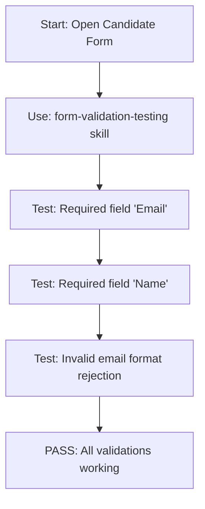

# Tester Skills Directory

Individual testing tactics and automation patterns live here. Each skill is a reusable testing procedure that can be applied across domains.

## Skill Organization

Each skill is a `.md` file that documents a specific testing pattern:

| Skill | Purpose | Example Use Case |
|-------|---------|------------------|
| `form-validation-testing.md` | Automated form testing patterns | Test candidate application form, trade order entry |
| `table-data-verification.md` | Verify table rows, sorting, filtering | Test candidate pipeline table, position list |
| `modal-workflow-testing.md` | Test modal sequences | Test interview scheduling modal, payment confirmation |
| `async-assertion-waiting.md` | Handle async operations (polling, debouncing) | Wait for API responses, status updates |
| `screenshot-comparison.md` | Visual regression testing | Verify UI didn't break, design consistency |

## Creating a New Skill

### Filename
`[capability]-testing.md` (lowercase, hyphenated)

Example: `form-validation-testing.md`, `table-sorting-testing.md`

### Structure

```markdown
# Form Validation Testing

**Goal:** Automated validation of form fields, error messages, and submission.

## Setup

Prerequisites and test data needed.

## Pattern: Test Required Field Validation

Step-by-step automation procedure with code examples.

## Example: Candidate Application Form

Real-world example showing how to apply the pattern.

## Reusable Code Snippet

JavaScript or automation code that can be copy-pasted.
```

## Using Skills in Tests

Reference a skill in your test definition:



In your test README:

```markdown
## Form Validation Tests

This test suite uses the **form-validation-testing** skill from `/roles/tester/skills/`.

See that skill file for reusable code patterns and setup instructions.
```

## Current Skills

None yet. Create the first skill by following the pattern above.
